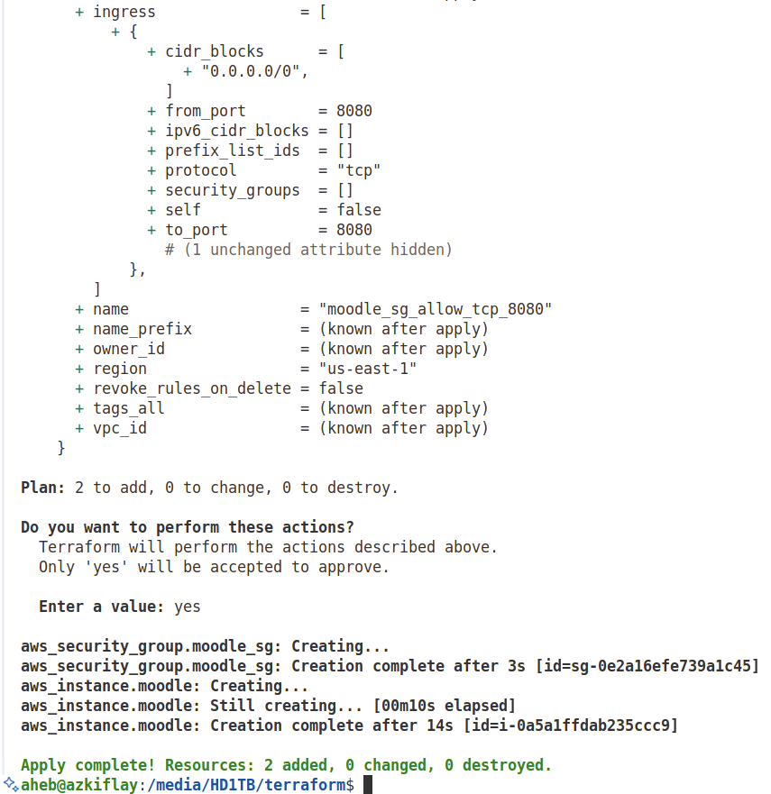

# Introduction
Server infrastructure used to be deployed and managed manually. However, that is not the case any more because manual system administration is time-consuming, error prone and cannot be scaled up to meet requirements of fast Continuous Cntegration and Continuous Deplayment (CI/CD) software delivery pipelines. Infrastructure as Code (IaC) tools fill this gap.

Terraform, developed by [HashiCorp](https://www.hashicorp.com/en), is an open-source IaC that is used to create and deploy infrastructure as code. It is widely used across cloud service providers, including Google Cloud Platform (GCP), Microsoft Azure, and Amazon Web Services (AWS). Terraform utilizes Application Programming Interfaces (APIs) of the cloud service providers to provision infrastructure such as virtual servers, databases, virtual networks, containers, load balancers, and so on. Interestingly, Terraform does all these in a re-usable few lines of code. 

Boradly, *ad hoc scripts*, *provsioning tools*, *server templating tools*, *orchestration tools*, and *configuration management tools* are considered as other methods of implementing IaC. While Terraform falls under *provisining*, it can also be used as a configuration management tool. Examples of *server templating* include Vagrant, Packer, and Docker. Kubernetes is one of the dominant tools for orchestration to define Docker containers as code, achieving high availability and scalability of infrastructure. Terraform can be combined with tools under different categories of the IaC ecosystem to define, create and orchestrate infrastrucre.

Apart from Terraform, there are other provisioning tools, including Puppet, Chef, Pulumi, Ansible, OpenStack, and CloudFormation. While each of the tools has its unique positioning in the IaC ecosystem, Terraform stands out because it is *agentless*, *masterless*, and it supports code *reusability*. Moreover, Terraform can be comined with other IaC tools such as the following. </br>
* **Terraform + Ansible**: Infrastructure provisioning using Terraform, followed by service configuration with Ansible. 
* **Packer + Terraform**: Server templating using Packer, followed by VM deployment using Terraform.
* **Packer + Kubernetes + Docker + Terraform**: Server templating of Kubernetes and Docker using Packer, followed by deployment of Kubernetes cluster using Terraform.

# Installation
In Ubuntu/Debian, Terraform can be installed using the following steps.
```bash
    # Install gnupg and software-properties-common packages 
    sudo apt-get update && sudo apt-get install -y gnupg software-properties-common
    # Install HashiCorp's GPG key.
    wget -O- https://apt.releases.hashicorp.com/gpg | \
    gpg --dearmor | \
    sudo tee /usr/share/keyrings/hashicorp-archive-keyring.gpg > /dev/null
    # Verify the GPG key's fingerprint.
    gpg --no-default-keyring --keyring /usr/share/keyrings/hashicorp-archive-keyring.gpg --fingerprint # The gpg command reports the key fingerprint
    # Add the official HashiCorp repository to your system
    echo "deb [arch=$(dpkg --print-architecture) signed-by=/usr/share/keyrings/hashicorp-archive-keyring.gpg] https://apt.releases.hashicorp.com $(grep -oP '(?<=UBUNTU_CODENAME=).*' /etc/os-release || lsb_release -cs) main" | sudo tee /etc/apt/sources.list.d/hashicorp.list
    # Update apt to download the package information from the HashiCorp repository
    sudo apt update
    # Install Terraform from the new repository
    sudo apt-get install terraform
    # Verify installation
    terraform -help # Successful if you get help message from terraform.
    terraform plan -help
    # Enable tab completion
    touch ~/.bashrc
    terraform -install-autocomplete # Restart your shell to enable autocomplete
```
Installation steps for other operating systems are available [here](https://developer.hashicorp.com/terraform/tutorials/aws-get-started/install-cli).

# Connecting Terraform with an AWS Account
* Create an IAM user on AWS with necessary permissions
* Create Access Key ID and Secret Access Key for the user
* Connect Terraform to the AWS user account by exporting the Access Key ID and Secret Access Key for the user as follows.
```bash
    # Needs to be done on very shell session.
    export AWS_ACCESS_KEY_ID=... # Replace ... with your key
    export AWS_SECRET_ACCESS_KEY=... # Replace ... with your key
```
Alternatively, the credentials can be set on AWS CLI as shown below, setting the access and secret keys long term.
```bash
    aws configure
    nano ~/.aws/credentials
```

After creating the "*.tf*" configuration file, Terraform need to scan the code, identify the provider and download the relevant code to "*.terraform*" subdirectory. Moreover, Terraform creates a "*.terraform.lock.hcl*" file to keep a record of the downloaded provider code. All these are done by issuing the "*terraform init*" command as shown below.
Terraform is init
```bash
    terraform init
```
The *init* command needs to be run to start a new Terraform code. Figure 1 shows an example output with an AWS provider.
<p align="center">
   <!-- width="400" height="200"/> --> <br>
</p>
<p align="center"><strong>Figure 1:</strong> Terraform initialization </p>

To run the following command, ensure to export the user credentials as shown earlier unless you are using the AWS CLI, in which case you would have set the user account details in "*~/.aws/credentials*".
```bash
    terraform plan
```
If successful, "*terraform plan*" will show you what changes will be implemented whenthe plan is enforced using "*terraform apply*". Figure 2 is a sample output of "*terraform plan*", which shows what resources will be created ("*+*" sign), deleted ("*-*") or modified ("*~*").

<p align="center">
   <!-- width="400" height="200"/> --> <br>
</p>
<p align="center"><strong>Figure 2:</strong> Terraform plan </p>

In this case, an Amazon Elastic Computer Cloud (EC2) instance will be created. The actual creation of the EC2 instance occurs when "*terraform apply*" is run. 

```bash
    terraform apply
```

After displaying the actions that it will take on approval, Terraform prompts you to enter **yes** to confirm the plan. When successfully executed, "*terraform apply*" displays a message on the local machine on which Terraform is running as shown in Figure 3. Moreover, the real-world effect of the command can be observed by the creation of an EC2 instance on AWS, as displayed to the right of Figure 3.
<figure>
<table>
  <tr>
    <td>
       <!-- width="400" height="200"/> --> <br>
    </td>
    <td>
       <!-- width="400" height="200"/> --> <br>
    </td>
  </tr>
</table>
<figcaption><strong>Figure 3: </strong> Results of terraform apply </figcaption>
</figure>

Note that the EC2 instance on AWS was created with the "*terraform apply*" command, and not by logging in to the EC2 console on AWS. Terraform was able to connect to the AWS account because it knows the credentials since they were set using export AWS_ACCESS_KEY_ID = ..." and "export AWS_SECRET_ACCESS_KEY = ...". To confirm whether Terraform has got you AWS account details, you can compare the keys in your account and compare them with the keys Terraform has locally, which can be obtained by the following commands. The respective values for AWS_ACCESS_KEY_ID, and AWS_SECRET_ACCESS_KEY should be the same locally and on your AWS account.
```bash
    echo $AWS_ACCESS_KEY_ID
    echo $AWS_SECRET_ACCESS_KEY
```

As can be seen in Figure 3, the instance does not have a name. You can give it a name by adding the following to the "*main.tf*" file, by adding it after *instance_type = "t2.micro"* line.
```bash
    tags = {
            Name = "moodle"
        }
```
To implement the change, you need to run "*terraform apply*" again.
```bash
    terraform apply
```
Now, Terraform modifies the existing instance by creating a *Name* tag, and setting the tag values as can be seen in Figure 4. The fact that Terraform displays "Refreshing state..." mesage shows that it knows that the instance has already been created. As a result, the instance has been assigned a name on AWS, as can be seen on the right side of Figure 4.

<figure>
<table>
  <tr>
    <td>
       <!-- width="400" height="200"/> --> <br>
    </td>
    <td>
       <!-- width="400" height="200"/> --> <br>
    </td>
  </tr>
</table>
<figcaption><strong>Figure 4: </strong> Modifying an existing instance </figcaption>
</figure>

Note that you need to save your Terraform configurations in a version control system (VCS) such as Git to be able to collaborate with your team. For example, you can create a Github repository and clone it. Moreover, ensure you add large Terraform files to "*.gitignore*" as follows.
```bash
    git clone https://github.com/azkiflay/terraform.git
    terraform init
    git add main.tf .terraform.lock.hcl
    echo ".terraform/" >> .gitignore
    echo terraform.tfstate >> .gitignore
    echo terraform.tfstate.backup >> .gitignore
    git add .gitignore
    git add README.md
    git commit -m "Initial commit"
    git push origin main # Share your commits to your team members.
    git pull origin main # Get commits made by your team members.
```

# Web Server Deployment
To deploy a simple webserver on the EC2 instance that was created, you can add the following to the "*main.tf*", within the "moodle" resource.
```bash 
    user_data = <<-EOF
            #!/bin/bash
            echo "Hello, World" > index.html 
            nohup busybox httpd -f -p 8080 & 
            EOF
        user_data_replace_on_change = true
```

To allow traffic to the web server, you need to create another resource, which specifies a security group for that purpose. This is shown in the following snippet.
```bash
    resource "aws_security_group" "moodle_sg" { 
        name = "moodle_sg_allow_tcp_8080"
        description = "Allow TCP traffic on port 8080"
        ingress { 
            from_port = 8080
            protocol = "tcp"
            to_port = 8080
            cidr_blocks = ["0.0.0.0/0"] # Allow traffic from all possible IP addresses
            }
    }
```

Subsequently, the "*moodle*" instance needs to know about the security group that was created. To do that, you add the following in the first "moodle" resource as follows.
```bash
    resource "aws_instance" "moodle" {
        ami = "ami-000d841032e72b43c" 
        instance_type = "t2.micro"
        vpc_security_group_ids = [aws_security_group.moodle_sg.id] # Security group
        ...
```

In other words, the aws_security_group.moodle_sg has to be created first because the *aws_instance* depends on it. That and other dependency can be view using "*terraform graph*". While taking care of dependencies, Terraform creates as many resources in parallel as possible.
```bash
  terraform graph # View resource dependency tree.
```

You need to run "*terraform plan*", and "*terraform apply*" again for these changes to take effect.
```bash
  terraform plan
  terraform apply
  curl http://<moodle_instance_public_ip:8080
```
The final result after *apply* is shown in Figure 5 below.

<p align="center">
   <!-- width="500" height="250"/> -->
</p>
<p align="center"><strong>Figure 5:</strong> Creating security group </p>

If everything went well up to this point, the web server should be up and ready for access. To verify if that is the case, you can use the public IP of the aws_instance (moodle). Open a web browser and type in *http://<moodle_instance_public_ip:8080* on the address bar. Alternatively, you can test the web server using *curl* as shown below.
```bash
  curl http://<moodle_instance_public_ip:8080
```
In both case, you should get a "Hello, World" message, confirming the Terraform successfully executed the plan accorindg to *main.tf*.


# Terraform and Configuration Management
Terraform can work with dedicated configuration management (CM) to automate infrastructure configuration.
## On lauch setup using shell scripts
On launch, Terraform can be configured to create and instantiate infrastructed by running a shell script.

```bash
    provider "aws" {
        region = "us-east-1"
    }
    

    

    tags = { 
        Name = "moodle-instance"
        } 
    }
```

The shell script that is specified within the "*user_data*" parameter runs at launch of the instance. Similarly, software can be installed, services configured and started. Shorter scripts can be inserted using "*<<- EOF ... EOF*" as shown above. However, for long shell scripts, it is better to save them as separate files and load them to Terraform using the **file()** function.


## Ansible with Terraform

```bash
    provider "aws" {
        region = "us-east-1"
    }
    resource "aws_instance" "moodle" {
    ami           = data.aws_ami.ubuntu.id
    instance_type = "t2.micro"

    user_data = <<-EOF
    #!/bin/bash apt-get update
    apt-get install -y ansible
    echo "${file("ansible.cfg")}" > /etc/ansible/ansible.cfg
    echo "${file("hosts")}" > /etc/ansible/hosts
    EOF

    tags = { 
        Name = "moodle-instance"
        } 
    }
```
With the **ansible.cfg** and **hosts** created at the same directory as the Terrform configuration file, the function **file()** is used copy the files to the instance launched by Terraform.

Note that script passed through the *user_data* parameter is run only once during the launch of the instance. To make further changes can be made using SSH-based remote access or preferrably Ansible playbooks. Instead of storing your Ansible configuration files locally, it is a good practice to store them in a securre repository. In this way, while Terraform creates the infrastructure, Ansible automates the configuration.