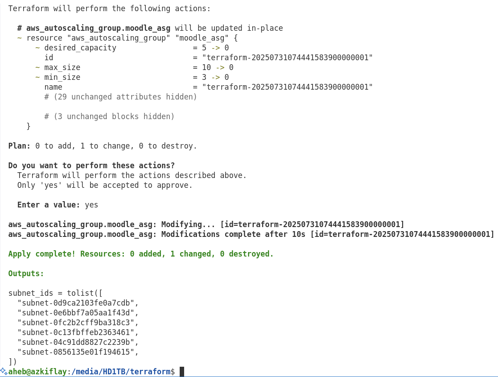
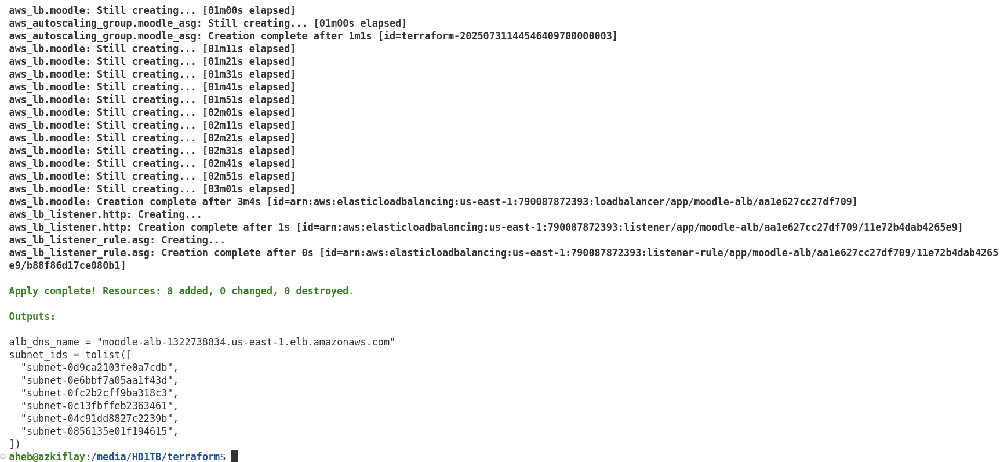

- [Introduction](#introduction)
- [Installation](#installation)
- [Connecting Terraform with an AWS Account](#connecting-terraform-with-an-aws-account)
- [Web Server Deployment](#web-server-deployment)
- [Terraform Variables](#terraform-variables)
  - [Input variables](#input-variables)
  - [Output Variables](#output-variables)
- [Web Server Cluster](#web-server-cluster)
  - [Creating ASG](#creating-asg)
  - [Destroying ASG](#destroying-asg)
  - [Load Balancer](#load-balancer)
- [Terraform State](#terraform-state)
  - [Local Terraform State](#local-terraform-state)
  - [Central Terraform State](#central-terraform-state)
  - [Configuring Amazon S3 Remote Store](#configuring-amazon-s3-remote-store)
- [Terraform and Configuration Management](#terraform-and-configuration-management)
  - [On launch setup using shell scripts](#on-launch-setup-using-shell-scripts)
  - [Ansible with Terraform](#ansible-with-terraform)


# Introduction
Server infrastructure used to be deployed and managed manually. However, that is not the case any more because manual system administration is time-consuming, error prone and cannot be scaled up to meet requirements of fast Continuous Integration and Continuous Deployment (CI/CD) software delivery pipelines. Infrastructure as Code (IaC) tools fill this gap.

Terraform, developed by [HashiCorp](https://www.hashicorp.com/en), is an open-source IaC that is used to create and deploy infrastructure as code. It is widely used across cloud service providers, including Google Cloud Platform (GCP), Microsoft Azure, and Amazon Web Services (AWS). Terraform utilizes Application Programming Interfaces (APIs) of the cloud service providers to provision infrastructure such as virtual servers, databases, virtual networks, containers, load balancers, and so on. Interestingly, Terraform does all these in a re-usable few lines of code. 

Broadly, *ad hoc scripts*, *provisioning tools*, *server templating tools*, *orchestration tools*, and *configuration management tools* are considered as other methods of implementing IaC. While Terraform falls under *provisioning*, it can also be used as a configuration management tool. Examples of *server templating* include Vagrant, Packer, and Docker. Kubernetes is one of the dominant tools for orchestration to define Docker containers as code, achieving high availability and scalability of infrastructure. Terraform can be combined with tools under different categories of the IaC ecosystem to define, create and orchestrate infrastructure.

Apart from Terraform, there are other provisioning tools, including Puppet, Chef, Pulumi, Ansible, OpenStack, and CloudFormation. While each of the tools has its unique positioning in the IaC ecosystem, Terraform stands out because it is *agentless*, *masterless*, and it supports code *reusability*. Moreover, Terraform can be combined with other IaC tools such as the following. </br>
* **Terraform + Ansible**: Infrastructure provisioning using Terraform, followed by service configuration with Ansible. 
* **Packer + Terraform**: Server templating using Packer, followed by VM deployment using Terraform.
* **Packer + Kubernetes + Docker + Terraform**: Server templating of Kubernetes and Docker using Packer, followed by deployment of Kubernetes cluster using Terraform.

# Installation
In Ubuntu/Debian, Terraform can be installed using the following steps.
```bash
    # Install gnupg and software-properties-common packages 
    sudo apt-get update && sudo apt-get install -y gnupg software-properties-common
    # Install HashiCorp's GPG key.
    wget -O- https://apt.releases.hashicorp.com/gpg | \
    gpg --dearmor | \
    sudo tee /usr/share/keyrings/hashicorp-archive-keyring.gpg > /dev/null
    # Verify the GPG key's fingerprint.
    gpg --no-default-keyring --keyring /usr/share/keyrings/hashicorp-archive-keyring.gpg --fingerprint # The gpg command reports the key fingerprint
    # Add the official HashiCorp repository to your system
    echo "deb [arch=$(dpkg --print-architecture) signed-by=/usr/share/keyrings/hashicorp-archive-keyring.gpg] https://apt.releases.hashicorp.com $(grep -oP '(?<=UBUNTU_CODENAME=).*' /etc/os-release || lsb_release -cs) main" | sudo tee /etc/apt/sources.list.d/hashicorp.list
    # Update apt to download the package information from the HashiCorp repository
    sudo apt update
    # Install Terraform from the new repository
    sudo apt-get install terraform
    # Verify installation
    terraform -help # Successful if you get help message from terraform.
    terraform plan -help
    # Enable tab completion
    touch ~/.bashrc
    terraform -install-autocomplete # Restart your shell to enable autocomplete
```
Installation steps for other operating systems are available [here](https://developer.hashicorp.com/terraform/tutorials/aws-get-started/install-cli).

# Connecting Terraform with an AWS Account
* Create an IAM user on AWS with necessary permissions
* Create Access Key ID and Secret Access Key for the user
* Connect Terraform to the AWS user account by exporting the Access Key ID and Secret Access Key for the user as follows.
```bash
    # Needs to be done on very shell session.
    export AWS_ACCESS_KEY_ID=... # Replace ... with your key
    export AWS_SECRET_ACCESS_KEY=... # Replace ... with your key
```
Alternatively, the credentials can be set on AWS CLI as shown below, setting the access and secret keys long term.
```bash
    aws configure
    nano ~/.aws/credentials
```

After creating the "*.tf*" configuration file, Terraform need to scan the code, identify the provider and download the relevant code to "*.terraform*" subdirectory. Moreover, Terraform creates a "*.terraform.lock.hcl*" file to keep a record of the downloaded provider code. All these are done by issuing the "*terraform init*" command as shown below.
Terraform is init
```bash
    terraform init
```
The *init* command needs to be run to start a new Terraform code. Figure 1 shows an example output with an AWS provider.
<p align="center">
   <!-- width="400" height="200"/> --> <br>
</p>
<p align="center"><strong>Figure 1:</strong> Terraform initialization </p>

To run the following command, ensure to export the user credentials as shown earlier unless you are using the AWS CLI, in which case you would have set the user account details in "*~/.aws/credentials*".
```bash
    terraform plan
```
If successful, "*terraform plan*" will show you what changes will be implemented when the plan is enforced using "*terraform apply*". Figure 2 is a sample output of "*terraform plan*", which shows what resources will be created ("*+*" sign), deleted ("*-*") or modified ("*~*").

<p align="center">
   <!-- width="400" height="200"/> --> <br>
</p>
<p align="center"><strong>Figure 2:</strong> Terraform plan </p>

In this case, an Amazon Elastic Computer Cloud (EC2) instance will be created. The actual creation of the EC2 instance occurs when "*terraform apply*" is run. 

```bash
    terraform apply
```

After displaying the actions that it will take on approval, Terraform prompts you to enter **yes** to confirm the plan. When successfully executed, "*terraform apply*" displays a message on the local machine on which Terraform is running as shown in Figure 3. Moreover, the real-world effect of the command can be observed by the creation of an EC2 instance on AWS, as displayed to the right of Figure 3.
<figure>
<table>
  <tr>
    <td>
       <!-- width="400" height="200"/> --> <br>
    </td>
    <td>
       <!-- width="400" height="200"/> --> <br>
    </td>
  </tr>
</table>
<figcaption><strong>Figure 3: </strong> Results of terraform apply </figcaption>
</figure>

Note that the EC2 instance on AWS was created with the "*terraform apply*" command, and not by logging in to the EC2 console on AWS. Terraform was able to connect to the AWS account because it knows the credentials since they were set using export AWS_ACCESS_KEY_ID = ..." and "export AWS_SECRET_ACCESS_KEY = ...". To confirm whether Terraform has got you AWS account details, you can compare the keys in your account and compare them with the keys Terraform has locally, which can be obtained by the following commands. The respective values for AWS_ACCESS_KEY_ID, and AWS_SECRET_ACCESS_KEY should be the same locally and on your AWS account.
```bash
    echo $AWS_ACCESS_KEY_ID
    echo $AWS_SECRET_ACCESS_KEY
```

As can be seen in Figure 3, the instance does not have a name. You can give it a name by adding the following to the "*main.tf*" file, by adding it after *instance_type = "t2.micro"* line.
```bash
    tags = {
            Name = "moodle"
        }
```
To implement the change, you need to run "*terraform apply*" again.
```bash
    terraform apply
```
Now, Terraform modifies the existing instance by creating a *Name* tag, and setting the tag values as can be seen in Figure 4. The fact that Terraform displays "Refreshing state..." message shows that it knows that the instance has already been created. As a result, the instance has been assigned a name on AWS, as can be seen on the right side of Figure 4.

<figure>
<table>
  <tr>
    <td>
       <!-- width="400" height="200"/> --> <br>
    </td>
    <td>
       <!-- width="400" height="200"/> --> <br>
    </td>
  </tr>
</table>
<figcaption><strong>Figure 4: </strong> Modifying an existing instance </figcaption>
</figure>

Note that you need to save your Terraform configurations in a version control system (VCS) such as Git to be able to collaborate with your team. For example, you can create a Github repository and clone it. Moreover, ensure you add large Terraform files to "*.gitignore*" as follows.
```bash
    git clone https://github.com/azkiflay/terraform.git
    terraform init
    git add main.tf .terraform.lock.hcl
    echo ".terraform/" >> .gitignore
    echo terraform.tfstate >> .gitignore
    echo terraform.tfstate.backup >> .gitignore
    git add .gitignore
    git add README.md
    git commit -m "Initial commit"
    git push origin main # Share your commits to your team members.
    git pull origin main # Get commits made by your team members.
```

# Web Server Deployment
To deploy a simple webserver on the EC2 instance that was created, you can add the following to the "*main.tf*", within the "moodle" resource.
```bash 
    user_data = <<-EOF
            #!/bin/bash
            echo "Hello, World" > index.html 
            nohup busybox httpd -f -p 8080 & 
            EOF
        user_data_replace_on_change = true
```

To allow traffic to the web server, you need to create another resource, which specifies a security group for that purpose. This is shown in the following snippet.
```bash
    resource "aws_security_group" "moodle_sg" { 
        name = "moodle_sg_allow_tcp_8080"
        description = "Allow TCP traffic on port 8080"
        ingress { 
            from_port = 8080
            protocol = "tcp"
            to_port = 8080
            cidr_blocks = ["0.0.0.0/0"] # Allow traffic from all possible IP addresses
            }
    }
```

Subsequently, the "*moodle*" instance needs to know about the security group that was created. To do that, you add the following in the first "moodle" resource as follows.
```bash
    resource "aws_instance" "moodle" {
        ami = "ami-000d841032e72b43c" 
        instance_type = "t2.micro"
        vpc_security_group_ids = [aws_security_group.moodle_sg.id] # Security group
        ...
```

In other words, the aws_security_group.moodle_sg has to be created first because the *aws_instance* depends on it. That and other dependency can be view using "*terraform graph*". While taking care of dependencies, Terraform creates as many resources in parallel as possible.
```bash
  terraform graph # View resource dependency tree.
```

You need to run "*terraform plan*", and "*terraform apply*" again for these changes to take effect.
```bash
  terraform plan
  terraform apply
  curl http://<moodle_instance_public_ip:8080
```
The final result after *apply* is shown in Figure 5 below.

<p align="center">
   <!-- width="500" height="250"/> -->
</p>
<p align="center"><strong>Figure 5:</strong> Creating security group </p>

If everything went well up to this point, the web server should be up and ready for access. To verify if that is the case, you can use the public IP of the aws_instance (moodle). Open a web browser and type in *http://<moodle_instance_public_ip:8080* on the address bar. Alternatively, you can test the web server using *curl* as shown below.
```bash
  curl http://<moodle_instance_public_ip:8080
```
In both case, you should get a "Hello, World" message, confirming the Terraform successfully executed the plan according to *main.tf* and deployed the web server on the AWS EC2 instance.

# Terraform Variables
## Input variables
Instead of defining the TCP port at different places, you can create a variable as follow, and refer to it every where it is needed.
```bash
  variable "server_port" {
          description = "The port the server will use for HTTP requests"
          type        = number
          default     = 8080
      }
```
If the default value for *server_port* variable is not set, you can specify the port as follows.

```bash
  terraform plan -var "server_port=8080"
  terraform apply -var "server_port=8080"
``` 
Alternatively, the port can also be defined as *environment variable* as follows.
```bash
  export TF_VAR_server_port=8080
  terraform plan
  terraform apply
```
## Output Variables
Output variables are used when you want to retrieve value of an attribute. For example, it may be helpful to reference the public IP address of the web server. You can do that using output variables as shown below.
```bash
  output "public_ip" {
        value       = aws_instance.moodle.public_ip # This will output the public IP address of the web server
        sensitive   = false # Set to true if you want to hide the output in the console
        description = "The public IP address of the web server"
    }
```

```bash
  terraform apply
  terraform output # Ensure the instance is running. Otherwise, the result will be --> public_ip=""
  terraform output public_ip
```
By using output variables such as the public IP address in the example, you can access the attribute values and use them as required.

# Web Server Cluster
Cluster of web servers is necessary to minimize the risk of a single point of failure. Creating a cluster enables you to route and load balance traffic across multiple web servers. In AWS, clusters are handled using *Auto Scaling Group (ASG)*. ASG has several useful cluster functionalities. It can launch a cluster of EC2 instances, monitor their health, replace failed ones, and adjust the cluster size according to traffic load.

## Creating ASG
To create an ASG, you need to remove the *resource "aws_instance" "moodle"*. Because the resource can create only one instance, but we want to create multiple instances (cluster) to avoid a single point of failure as well as to load balance among them. Instead, create the following *launch template* that will be later used to create a cluster. Previously, a *launch configuration* was used to created ASGs, but that has been deprecated. The preferred way to create ASGs is through *aws_launch_template*. Among other parameters, a name for each instance can be given using *tag_specifications, as well as specification of what commands to run on instance launch using *user_data*. Now, commands in *user_data* have to be passed encoded using *base64encode()*. The *lifecycle* takes care of the order of creating a new instance to replacing an old one that is to be destroyed. Notably, necessary information from the old instance has to be copied to the new before the former is replaced by the latter.
```bash
  resource "aws_launch_template" "moodle" {
        image_id      = "ami-000d841032e72b43c" # when not cluster --> ami = "ami-000d841032e72b43c" as above
        instance_type = "t2.micro"
    
        lifecycle {
            create_before_destroy = true
        }
        # user_data # Base64 encoded user data script required for the launch template
        user_data = base64encode(<<-EOF
            #!/bin/bash
            echo "Hello, World" > index.html 
            nohup busybox httpd -f -p 8080 & 
            EOF
        )
        tag_specifications {
                resource_type = "instance"
                tags = {
                Name = "Moodle-ASG-Instance"
            }
        }
    }
```

Based on the *aws_launch_template*, the ASG can be created as follows. Note that 
```bash
  resource "aws_autoscaling_group" "moodle" {
        launch_template {
            id      = aws_launch_template.moodle.id
            version = "$Latest"
      }
        min_size             = 5 # Minimum number of instances in the ASG
        max_size             = 10 # Maximum number of instances in the ASG
        desired_capacity     = 5 # Desired number of instances in the ASG
        vpc_zone_identifier  =  data.aws_subnets.default.ids
  }
```

In the ASG resource, the number of instances have been specified using *min_size*, *max_size* and *desired_capacity*. In other words, the ASG launches preferably *desired_capacity*, at least *min_size*, and a maximum of *max_size* EC2 instances. 

Lastly, the ASG needs to be assigned a subnet, which can be set using *vpc_zone_identifier*. Virtual Private Cloud (VPC) are divided into subnets, creating smaller networks where infrastructure resources such as AWS EC2 instances, databases and load balancers can be created. The are *public* and *private* subnets. While the latter are used for backend systems and internal networks, public subnets are connected to the Internet. Each subnet exists in one Availability Zone (AZ), which is an isolated data center in AWS. Deploying instances in multiple subnets ensures the availability of services when there is downtown at a particular AZ.

In Terraform, the *vpc_zone_identifier* is a required argument for the *aws_autoscaling_group* resource, specifying the list of subnet IDs where the ASG should launch EC2 instances. The ASG will distribute instances across multiple subnets and AZs for high availability. While a specific subnet can be assigned to the ASG, note that it is better to retrieve it using Terraform to lookup the subnet dynamically. The *data* resource is used to query your AWS VPC and subnets, and other existing data through the provider's APIs. Filters can be used to fetch information of interest (e.g., public IP address).

 To make these changes to your infrastructure code, add the following resources to your *main.tf* file.

```bash
    data "aws_vpc" "default" { # Get the default VPC
        default = true
    }
    
    data "aws_subnets" "default" { # Get all subnets in that VPC
        filter {
            name   = "vpc-id"
            values = [data.aws_vpc.default.id]
        }
    }

    data "aws_subnets" "public" {
        filter {
            name   = "tag:Type"
            values = ["public"]
        }
    }

    output "subnet_ids" {
        value = data.aws_subnets.default.ids
    }
```

Execute *terraform plan* and *terraform apply* to create the infrastructure according to these Terraform configurations.
```bash
  terraform plan
  terraform apply
```
Figure 6 shows the results that were obtained in the preparation of this tutorial. Like before, there are two parts to the output. Namely, the message displayed by Terraform at the local machine, and the created infrastructure on AWS.

<figure>
<table>
  <tr>
    <td>
       <!-- width="400" height="200"/> --> <br>
    </td>
    <td>
       <!-- width="400" height="200"/> --> <br>
    </td>
  </tr>
</table>
<figcaption><strong>Figure 6: </strong> Creating ASG instances </figcaption>
</figure>

On the left side of Figure 6, Terraform displays messages about progress, a count of the resources it created, modified and destroyed. More importantly, Terraform prepares the actual infrastructure as defined by the configuration files on AWS, as display on the right of Figure 6. You can see that *5* instances are created according to the template

Notably, the ASG resource now created *5* EC2 instances based on *aws_launch_template*. In other words, five different web servers have been deployed. As stated earlier, deploying a cluster of web servers enables you to load balance among them as well as to ensure high availability of the service in case some of them fail for some reason. 

Five instances were created because the *"aws_autoscaling_group"* was created with "* desired_capacity = 5 *". Other related parameters are the *min_size* and *max_size* of the resource. Perhaps, the next change will show you how convenient (and risky, if not used carefully) Terraform makes it to provision infrastructure.

## Destroying ASG
Change values of *min_size*, *max_size*, and *desired_capacity* to *0* and apply the configuration to see what happens. 
```bash
  resource "aws_autoscaling_group" "moodle" {
        ...
        min_size             = 0 # Minimum number of instances in the ASG
        max_size             = 0 # Maximum number of instances in the ASG
        desired_capacity     = 0 # Desired number of instances in the ASG
        vpc_zone_identifier  =  data.aws_subnets.default.ids
  }
```

```bash
  terraform plan
  terraform apply
```

The results are shown in Figure 7. You can see that all the ASG instances were destroyed on AWS. This happened because *min_size*, *max_size*, and *desired_capacity* were all set to *0* in the Terraform configuration file. The ability to create and destroy infrastructure with this level of ease shows the power of Terraform as an Infrastructure as Code (IaC) tool. However, caution is necessary when setting the aforementioned parameter values to *0* in production environments.

<figure>
<table>
  <tr>
    <td>
       <!-- width="400" height="200"/> --> <br>
    </td>
    <td>
       <!-- width="400" height="200"/> --> <br>
    </td>
  </tr>
</table>
<figcaption><strong>Figure 7: </strong> Destroying ASG instances </figcaption>
</figure>

## Load Balancer
The ASG above creates a web server cluster using the multiple EC2 instances. One the one hand, there are multiple web servers each with its own IP address. On the other hand, you want users to access the service using a single IP address or domain name. Load balancers address this problem by sitting as a gateway to the EC2 instances of the ASG. Users access the web servers through a load balancer, which re-directs traffic based on the status and load of each EC2 instance. For this, you can use Amazon's *Elastic Load Balancer (ELB)* service. 

Common types of ELB's include the following:
* Application-layer Load Balancer (ALB), which load balances HTTP and HTTPS traffic
* Network-layer Load Balancer (NLB), which load balances TCP, UDP and TLS traffic.

For a web server, you can deploy ALB as the load balancer. ALB is made up of three components, namely, *Listener*, *Listener Rules*, and *Target Groups*. While a *Listener* specifies which port to listen on for requests, a *Listener Rule* decides where among *Target Groups*, and where exactly within each one of them, a request should be sent to. Finally, a *Target Group* refers to a group of servers that processes requests received from the load balancer. Moreover, server health checks are performed for each *Target Group* so that requests are sent only to those that can handle them.

To create a load balancer, you need to create the ALB-related resources, namely *listener*, *listener rule*, and *target group*. Moreover, you need to create a *security group* to allow traffic to the load balancer since the default rule is to block all incoming and outgoing traffic.

Therefore, to create a load balancer in your infrastructure, first you need to create the ALB using the using the "*aws_lb*" resource as shown in the following.
```bash
  resource "aws_lb" "moodle" {
    name = "moodle-lb"
    load_balancer_type = "application"
    internal           = false
    subnets = data.aws_subnets.default.ids
    security_groups = [aws_security_group.moodle_lb_sg.id]
}
```

Secondly, add a "*aws_lb_listener*" resource for HTTP traffic as shown below, configuring the "*aws_lb*" to listen on port 80 among other settings.
```bash
    resource "aws_lb_listener" "http" {
      load_balancer_arn = aws_lb.moodle.arn
      port = var.server_port
      protocol = "HTTP"
      default_action {
          type = "fixed-response"
          fixed_response {
              content_type = "text/plain"
              message_body = "404: page not found."
              status_code = 404
          }
      }
    }
```

Thirdly, create as "*aws_lb_listener_rule*" resource to determine where to direct requests, as shown below.
```bash
  resource "aws_lb_listener_rule" "moodle" {
    listener_arn = aws_lb_listener.http.arn
    priority      = 100
    action {
        type = "forward"
        forward {
            target_group {
                arn = aws_lb_target_group.moodle.arn
            }
        }
    }
    condition {
        path_pattern {
            values = ["*"]
        }
    }
  }
```

Fourthly, create the *target group* resource using "*aws_lb_target_group*" as follows. To get the latest data on each EC2 instance, the target group probes the instances by sending HTTP requests periodically. 
```bash
  resource "aws_lb_target_group" "moodle" {
    name = "moodle-lb-tg"
    port     = var.server_port
    protocol = "HTTP"
    vpc_id   = data.aws_vpc.default.id
    health_check {
        path                = "/"
        protocol            = "HTTP"
        matcher =           "200"
        interval            = 15
        timeout             = 3
        healthy_threshold   = 2
        unhealthy_threshold = 2

    }
  } 
```

Fifthly, create a security group for the load balancer using "*aws_security_group*" resource as shown below, which allows requests on port 80. Moreover, all outgoing requests should be allowed to be able to send health check requests to the EC2 instances, by setting "*from_port*", "*to_port*", and "*protocol*" to 0, 0, and -1, respectively.
```bash
  resource "aws_security_group" "moodle_lb_sg" {
    name        = "moodle"
    description = "Security group for the Moodle load balancer"
    # "Allow inbound HTTP requests"
    ingress {
        from_port   = var.server_port
        to_port     = var.server_port
        protocol    = "tcp"
        cidr_blocks = ["0.0.0.0/0"]
    }
    # Allow all outbound requests
    egress {
        from_port   = 0
        to_port     = 0 
        protocol    = "-1"
        cidr_blocks = ["0.0.0.0/0"]
    }
  }
``` 

Sixthly, add the following to the original "*aws_autoscaling_group*" resource to connect it with the load balancer.
```bash
  resource "aws_autoscaling_group" "moodle" {
    ...
    target_group_arns = [aws_lb_target_group.moodle.arn]
    health_check_type = "ELB" 
  }
```
Finally, you want to know the IP address or domain name of the load balancer so that your web server can be accessed with it. To that end, add the following output using "*alb_dns_name*" resource.
```bash
  output "alb_dns_name" {
    value       = aws_lb.moodle.dns_name
    description = "The domain name of the load balancer"
  }
```

Now, it is time to check the Terraform plan and apply it using "*terraform plan*" and "*terraform apply*", respectively.
```bash
  terraform plan
  terraform apply
```
If you everything went according to the above steps, you should be able to something similar to the results displayed in Figure 8.

<figure>
<table>
  <tr>
    <td>
       <!-- width="400" height="200"/> --> <br>
    </td>
    <td>
       <!-- width="400" height="200"/> --> <br>
    </td>
  </tr>
</table>
<figcaption><strong>Figure 8: </strong> Elastic Load Balancer (ELB) </figcaption>
</figure>

Eight resources were added as shown by Terraform's message. As can been from the AWS Instance list, **five** EC2 instances were created based on the configurations discussed earlier. Additionally, Terraform displayed the domain name of the load balancer as an output, namely, **alb_dns_name = "moodle-alb-1322738834.us-east-1.elb.amazonaws.com"** as can be seen in Figure 8. 

The implication is that all the five EC2 instances in the cluster can be accessed using the single domain name. You can put the domain name of the load balancer (**moodle-alb-1322738834.us-east-1.elb.amazonaws.com**) on your browser to test the web server. You should be able to get a "Hello, World" message.

Note that the EC2 instances in the cluster are checked regularly for their health status. Therefore, if one of the instances is overloaded with too many user requests, the load balancer identifies less busy instances and redirects traffic to them. Notably, if any of the instances fails for some reason, a new one will be created to replace it because the ASG works to maintain the desired number of instances as defined in the configuration file. This can be confirmed by selecting and terminating one of the EC2 instances on AWS.

As shown in Figure 9, when one instance of the ASG was terminated, a new one started to be created automatically. When you refresh your browser after deleting one of the ASG instances, you will see a new one being created almost instantly. The one that has *Initializing* on the Status Check column is a new being created to replace the one that was terminated manually. The reason for termination can be something else, however as long as Terraform has been configured to keep a specific number of instances in the ASG, it will automatically create new instance if there are less number of EC2 instances than required.

<figure>
<table>
  <tr>
    <td>
       <!-- width="400" height="200"/> --> <br>
    </td>
    <td>
       <!-- width="400" height="200"/> --> <br>
    </td>
  </tr>
</table>
<figcaption><strong>Figure 9: </strong> Self-healing (automatic replacement) of instances in the ASG </figcaption>
</figure>

Finally, when the life cycle of the infrastructe comes to an end, you can delete it as shown below. 
```bash
  terraform destroy
```
However, you must be careful when deleting because there is no way to recover your infrastructure if you destroyed it in this way. Therefore, you must be certain that you do NOT need any of the resources in the project whose infrastructure is to be deleted. In any case, since Terraform is an IaC tool, you can re-create the same infrastructure again by running "*terraform apply*" as long as you have your Terraform file.

Note that the *destroy* operation takes somewhat longer time because Terraform need to work with a dependency tree, identifying the right order to delete resources. 

Figure 10 shows Terraform's message on the local machine, stating that *8* resources were destroyed. In addition, Figure 10 displays the EC2 instances that are being deleted on AWS. On refresh, the instances were indeed terminated for good.

<figure>
<table>
  <tr>
    <td>
       <!-- width="400" height="200"/> --> <br>
    </td>
    <td>
       <!-- width="400" height="200"/> --> <br>
    </td>
  </tr>
</table>
<figcaption><strong>Figure 10: </strong> Destroying EC2 instances in the ASG </figcaption>
</figure>


# Terraform State
This section discusses how Terraform knows the infrastructure that is already in place when you run "*terraform plan*", "*terraform apply*" or similar commands. When you change the configuration of an existing infrastructure, Terraform does not create every resource from scratch. It detects currently present infrastructure components, and adds or modifies resources according to the latest configuration. 

In other words, Terraform calculates the difference between the current and the desired infrastructure state. But how does Terraform know details of the previously provisioned resources at a time when Terraform configuration files change to meet the desired infrastructure state? The answer: It keeps a separate **state file** to track the resources as they existed prior to the changes.

**Terraform state** is a file that records details about the infrastructure created by a Terraform configuration. The file is created for every folder where Terraform is initiated. Accordingly, a "**terraform.state**" is created, containing entries in JSON format that match resources to their real-world representation.

When *terraform plan* is run, the state file (**terraform.state**) is used as the starting point to calculate what changes have to be made to fulfill the desired infrastructure state as described in the latest Terraform configuration. Therefore, the changes that happen on every *terraform apply* consist of the difference between the current real-world infrastructure deployment (**terraform.state**) and the desired state (the latest "**.tf**" files).

For example, Figure 11 displays the first few lines of *terraform.state* file using "*nano terraform.state*".
```bash
  nano terraform.state
```

<figure>
<table>
  <tr>
    <td>
       <!-- width="400" height="200"/> --> <br>
    </td>
    <td>
       <!-- width="400" height="200"/> --> <br>
    </td>
  </tr>
</table>
<figcaption><strong>Figure 11: </strong> Terraform state </figcaption>
</figure>

When *terraform apply* is issued to create the infrastructure, the *terraform.state* file is generated automatically. Therefore, the state file is not supposed to be edited manually. Because its purpose is only to keep an internal record about the deployed infrastructure resources, and for Terraform to use it as a reference when configuration changes are made in future.

## Local Terraform State
By default, Terraform saves the state file in the current working directory on a local machine where "*terraform init*" was executed. While keeping a local copy of the *terraform.state* file is fine for an individual-based work, it is not suitable for team-based working. In the latter, team members utilize Terraform to add and remove resources. In that case, coordination challenges emerge if each member of the team keeps the sate file on their local machine. For example, if a team member issued "*terraform destroy*" on their local host, the **terraform.state** file would look like the following.

<p align="center">
   <!-- width="500" height="250"/> -->
</p>
<p align="center"><strong>Figure 12:</strong> Local Terraform state </p>

As indicated by ("**resources": []**) in Figure 12, it can be seen that there are no resources according to the *terraform.state* file in the local host that belongs to the individual who issued the "*terraform destroy*". In such a case, there is no way for other team members to know about the fact that all resources have been destroyed. Furthermore, there would be conflicting and corrupted infrastructure state if another member of the team issued *terraform apply* to create new resources, not even knowing another colleague had issued "*terraform destroy*". So, how can members of a team know the correct and latest state of the infrastructure?

Surely, they would have known if they had access to the latest **terraform.state**. However, coordination problems arise when multiple and different *terraform.state* files exist on the local machines of the team members. If they make changes to Terraform configuration, while keeping different state files locally, they will end up with conflicting and corrupted infrastructure state. To solve this problem, the team can work using a centralized copy of *terraform.state*.

A centralized *terraform.state* enables team members to know the latest state of the infrastructure before they start making changes to it. However, when working using a shared *terraform.state*, there is a need to avoid a race condition in situations where multiple team members try to make changes at the same time. The possibility for a race condition is solved using a locking mechanism. When a team member is making changes to the *terraform.state*, the file is locked from access by others. Each member of the team can apply configuration changes only after they are given access to the file lock. Effectively, the locking mechanism blocks concurrent Terraform processes from making changes to infrastructure, avoiding file access conflicts, data loss, and possible corruption of the state of the infrastructure.

## Central Terraform State
To address the challenges of keeping local *terraform.state* files, a centralized system can be used by a team. In many similar situations, one of the best solutions for collaborative working would be to use a Version Control Systems (VCS) such as Git. However, VCSes are not good enough for storing *terraform.state* file.  Although VCSes are great for storing other Terraform configuration files, they do not provide locking mechanism, which is critical for *terraform.state*. Moreover, **secrets** used in Terraform resources are stored in plain text. Therefore, storing *terraform.state* in VCSes such as Git would expose secrets, compromising the security of and access to your infrastructure.

To address these challenges, Terraform has a built-in support for **remote backends**. By default, Terraform uses a **local backend**, storing the *terraform.state* file on the disk of a local host. By comparison, a remote backend saves the *terraform.state* file in a shared and remote storage. Remote backends enable a secure way to share the *terraform.state* file among team members, enabling collaboration while keeping a consistent infrastructure state. With a remote backend, every change to the infrastructure configuration will be made by referring to the remotely stored *terraform.state*, as well as updating the state file to reflect any configuration changes. 

Consequently, on *terraform plan*, Terraform downloads the *terraform.state* from the remote backend, and uploads the state file to the remote backend at the end of every *terraform apply*. As stated earlier, only one Terraform process has the lock, so there will not be any race conditions between *terraform apply* from multiple team members. Moreover, remote backends encrypt *terraform.state* file in transit and at rest, keeping secrets of the Terraform resources secure. Effectively, the *terraform.state* file is kept always encrypted.

Remote backends supported by Terraform include HashCorp's own Terraform Cloud and Terraform Enterprise, and other vendor-specific solutions. For AWS, Terraform supports **Amazon Simple Storage Service (S3)** as a remote backend. Every change made to your infrastructure can be retrieved from Amazon S3 due to its approach to storing *terraform.state* versions. If something in your infrastructure goes wrong, you can go back to an earlier version until you find and fix the cause of the problem.

## Configuring Amazon S3 Remote Store
To configure Terraform to use a remote backend, you will need to make configuration changes locally. But before you do that, you need to create an S3 bucket that will be used as the backend. As depicted in Figure 13, the S3 bucket can be created on AWS Management Console. Note that you cannot have "_" in the name as that is invalid character for an S3 bucket, and the name must be globally unique across all AWS customers. Therefor, if you do not choose a common name, expect an error stating that file name has been already taken.

<figure>
<table>
  <tr>
    <td>
       <!-- width="400" height="200"/> --> <br>
    </td>
    <td>
       <!-- width="400" height="200"/> --> <br>
    </td>
  </tr>
</table>
<figcaption><strong>Figure 11: </strong> Terraform state </figcaption>
</figure>

Alternatively, the S3 bucket can be created using the AWS CLI as shown below.
```bash
aws s3api create-bucket \
  --bucket azkiflay-moodle-terraform-state \
  --region us-east-1
```

What you want to happen next for the local *terraform.state* to be a starting point on the remote backend. Before the remote backend is configured, run *terraform init* on your local machine.
```bash
  terraform init
```
Then, to change move the state file from the local host to the remote backend (the S3 bucket created earlier), create the following resources. Note that the *bucket = "azkiflay-moodle-terraform-state"* refers to the S3 bucket already created on AWS. If you not, you need to create it using as discussed above.

```bash
  provider "aws" {
    region = "us-east-1"
  }

  resource "aws_s3_bucket" "azkiflay-moodle-terraform-state" {
    bucket = "azkiflay-moodle-terraform-state"
    force_destroy = true
  }

  resource "aws_s3_bucket_versioning" "enabled" {
    bucket = aws_s3_bucket.azkiflay-moodle-terraform-state.id
    versioning_configuration {
      status = "Enabled"
    }
  }

  resource "aws_s3_bucket_server_side_encryption_configuration" "default" {
    bucket = aws_s3_bucket.moodle_terraform_state.id
    rule {
      apply_server_side_encryption_by_default {
        sse_algorithm = "AES256"
      }
    }
  }

  resource "aws_s3_bucket_public_access_block" "public_access" {
    bucket = aws_s3_bucket.azkiflay-moodle-terraform-state.id
    block_public_acls       = true
    ignore_public_acls      = true
    block_public_policy     = true
    restrict_public_buckets = true
  }

  resource "aws_dynamodb_table" "azkiflay-moodle-terraform-locks" {
    name         = "azkiflay-moodle-terraform-locks"
    billing_mode = "PAY_PER_REQUEST"
    hash_key     = "LockID"
    attribute {
      name = "LockID"
      type = "S"
    }
    lifecycle {
      prevent_destroy = true
    }
  }
```

Subsequently, to configure Terraform so that it saves the *terraform.state* on the remote S3 store, you need to add to your Terraform file so that it uses the bucket you created. To that end, create the following resources in **main.tf** within a **backend** subdirectory. You can see that the bucket create above ("*azkiflay-moodle-terraform-state*") is used in the *aws_s3_bucket* resource. Due to this, Terraform will not store its *terraform.state* locally, instead it will be uploading to and downloading from the S3 bucket.
```bash
    terraform {
    required_providers {
      aws = {
        source  = "hashicorp/aws"
        version = "~> 6.0"
      }
    }
    backend "s3" {
      bucket         = "azkiflay-moodle-terraform-state" # Must be globally unique
      key            = "global/s3/terraform.tfstate"
      region         = "us-east-1"
      dynamodb_table = "azkiflay-moodle-terraform-locks"
      encrypt        = true
    }
  }
```

Note that other configuration changes are also made. These include the locking mechanism (*dynamodb_table*) and the region where the S3 bucket exists. Terraform fetches these setting from other AWS resources that are created for the respective functionalities. The following summarizes configurations of these resources.

Finally, you need to run Terraform to apply the changes and use the S3 store as its backend, using *terraform init*.
```bash
  terraform init
```
As you can see in Figure 14, Terraform detects a remote backend "**s3**" successfully. This means that your infrastructure configuration now will be stored remotely on the S3 bucket. Consequently, you can have multiple people working collaboratively on your infrastructure without worrying about corrupting the *terraform.state* file, race conditions, and without secrets being accidentally exposed accidentally.


# Terraform and Configuration Management
Terraform can work with dedicated configuration management (CM) to automate infrastructure configuration.
## On launch setup using shell scripts
On launch, Terraform can be configured to create and instantiate infrastructure by running a shell script.

```bash
    provider "aws" {
        region = "us-east-1"
    }
       

    tags = { 
        Name = "moodle-instance"
        } 
    }
```

The shell script that is specified within the "*user_data*" parameter runs at launch of the instance. Similarly, software can be installed, services configured and started. Shorter scripts can be inserted using "*<<- EOF ... EOF*" as shown above. However, for long shell scripts, it is better to save them as separate files and load them to Terraform using the **file()** function.

## Ansible with Terraform

```bash
    provider "aws" {
        region = "us-east-1"
    }
    resource "aws_instance" "moodle" {
    ami           = data.aws_ami.ubuntu.id
    instance_type = "t2.micro"

    user_data = <<-EOF
    #!/bin/bash apt-get update
    apt-get install -y ansible
    echo "${file("ansible.cfg")}" > /etc/ansible/ansible.cfg
    echo "${file("hosts")}" > /etc/ansible/hosts
    EOF

    tags = { 
        Name = "moodle-instance"
        } 
    }
```
With the **ansible.cfg** and **hosts** created at the same directory as the Terraform configuration file, the function **file()** is used copy the files to the instance launched by Terraform.

Note that script passed through the *user_data* parameter is run only once during the launch of the instance. To make further changes can be made using SSH-based remote access or preferably Ansible playbooks. Instead of storing your Ansible configuration files locally, it is a good practice to store them in a secure repository. In this way, while Terraform creates the infrastructure, Ansible automates the configuration.